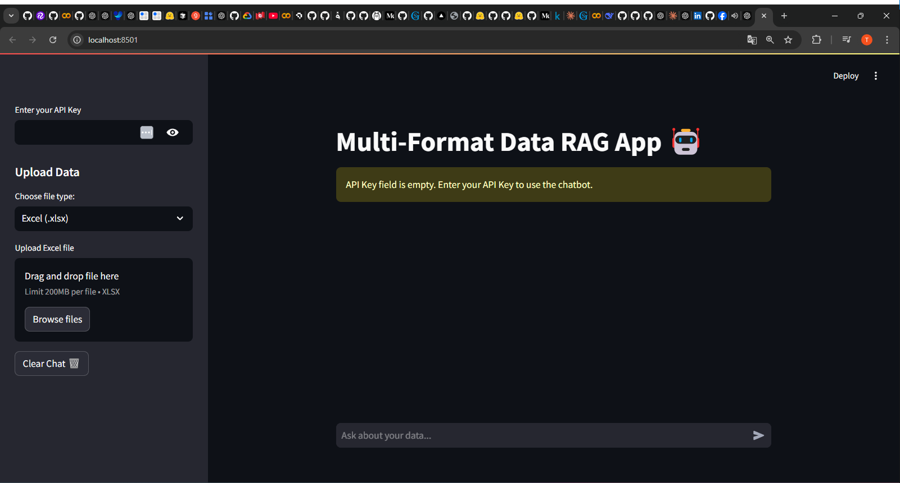

# Multi-Format-Data-RAG-App-

Welcome to the **Multi-Format Data Analysis RAG Application**! This is a Retrieval-Augmented Generation (RAG) application that allows users to upload and analyze data from multiple formats, such as **Excel** and **JSON**. Powered by the **Llama-3.3 model** through the **Together AI API**, this application generates precise, context-aware answers based on the data you provide.

## Key Features

- **Easy file upload**: Upload your Excel or JSON files effortlessly via a user-friendly **Streamlit** interface.
- **Data indexing**: Automatically generates an index for your data to enable efficient searches and in-depth analysis.
- **Smart responses**: Powered by the **Llama-3.3-70B-Instruct-Turbo**, providing precise, actionable insights in real-time.
- **Seamless interaction**: Simply ask questions about your data and get instant, accurate answers.

## Demo

Here is a screenshot of the application interface:



The app uses the **Iris dataset** as a demonstration, but you can upload your own Excel or JSON files to analyze any data. The application isn't limited to a specific dataset, so feel free to explore it with your own data files.

## How It Works

1. **Upload your file**: Choose an Excel or JSON file from your local machine.
2. **Data indexing**: The application automatically processes the data, creating an index for efficient searches.
3. **Ask your questions**: Type questions related to the data you uploaded, and the model will provide context-aware answers.
4. **Explore insights**: Get real-time insights and explore the data's potential.

## Technologies Used

- **Together AI API**: For integrating the Llama-3.3 model to generate intelligent, context-aware answers.
- **Streamlit**: For building the interactive user interface.
- **HuggingFace Embeddings**: For efficient text embedding and data indexing.
- **Pandas**: For processing and managing Excel and JSON data.

## Getting Started

### Prerequisites

Before running the application, make sure you have the following installed:

- Python 3.7+
- `pip` for installing dependencies

### Install Dependencies

Clone the repository and install the required Python packages:

```bash
git clone https://github.com/yourusername/your-repository-name.git
cd your-repository-name
pip install -r requirements.txt
